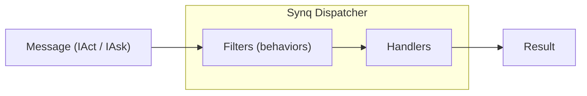

# 🧠 Synq  
**A next-generation CQRS and pipeline orchestration framework for .NET 9**

> Designed for simplicity, composability, and power.  
> Inspired by Clean Architecture, MediatR, and Futeq’s internal frameworks.  
> No dependencies, no magic — just pure, extensible message pipelines.

---

## ✨ Overview

Synq is a lightweight mediator & pipeline engine built for **command–query responsibility segregation (CQRS)**.  
It provides a minimal core (dispatch, handlers, filters) and a flexible builder API to wire up your **cross-cutting behaviors**.



Unlike heavy mediators, **Synq** has no reflection scanning or internal DI magic — everything is explicit, testable, and fast.

---
## Support the development
If you like what you see here, feel free to donate to contribute to our open-source efforts. All donations will be received by the contributing engineers!

<a href="https://www.buymeacoffee.com/futeq" target="_blank"></a>
---
## 🧭 Quick Start TL;DR

```csharp
services.AddSynq(b => b
    .ScanHandlers(typeof(Program).Assembly)
    .AddCommonFilters()
    .AddCommandFilters()
    .AddCachingPreset()
);

var result = await synq.Dispatch(new GetUser(Guid.NewGuid()));
```
---

## 🧩 Packages

| Package | Description |
|----------|--------------|
| **FQ.Synq** | Core abstractions and dispatcher |
| **FQ.Synq.Filters** | Common cross-cutting filters (validation, auth, perf, etc.) |
| **FQ.Synq.Filters.Caching** | Caching filters for `IAsk<T>` and invalidation for `IAct` |
| *(Future)* FQ.Synq.Filters.Messaging | Distributed event bus integration |

---

## 🏗️ Installation

```bash
dotnet add package FQ.Synq
dotnet add package FQ.Synq.Filters
dotnet add package FQ.Synq.Filters.Caching
```

---

## 🧱 Core Concepts

### Messages
A **message** represents an intent.  
Two primary kinds:

```csharp
public interface IAct : IMessage<Nil> { }         // Command - write
public interface IAct<TOut> : IMessage<TOut> { }  // Command returning a value
public interface IAsk<TOut> : IMessage<TOut> { }  // Query - read only
```

---

### Handlers
Handlers process a single message type.

```csharp
public sealed record GetUser(Guid Id) : IAsk<UserDto>;
public sealed class GetUserHandler : IMessageHandler<GetUser, UserDto>
{
    public Task<UserDto> Handle(GetUser message, CancellationToken ct)
    {
        return Task.FromResult(new UserDto(message.Id, "Alice"));
    }
}
```

---

### Dispatcher (ISynq)
The entry point for executing messages:

```csharp
var result = await synq.Dispatch(new GetUser(Guid.NewGuid()));
```

---

## ⚙️ Dependency Injection Setup

```csharp
using FQ.Synq;
using FQ.Synq.Filters;

builder.Services.AddSynq(b => b
    .ScanHandlers(typeof(Program).Assembly)
    .AddWebApiDefaults(includeIdempotency: true)
);
```

---

## 🔄 Pipelines

Each message runs through a **filter chain**, similar to ASP.NET middleware.

Example pipeline order for commands:

```text
Validation → Authorization → Idempotency → UnitOfWork → Handler → DomainEvents → CacheInvalidation
```

Queries:

```text
Validation → Authorization → QueryCache → Handler
```

---

## 🧩 Writing Custom Filters

Filters implement:

```csharp
public interface IFilter<TMessage, TOut>
{
    Task<TOut> Invoke(TMessage message, CancellationToken ct, Next<TOut> next);
}
```

Example logging filter:

```csharp
public sealed class LoggingFilter<T, TOut> : IFilter<T, TOut>
    where T : IMessage<TOut>
{
    private readonly ILogger<LoggingFilter<T, TOut>> _log;

    public LoggingFilter(ILogger<LoggingFilter<T, TOut>> log)
    {
        _log = log;
    }

    public async Task<TOut> Invoke(T message, CancellationToken ct, Next<TOut> next)
    {
        _log.LogInformation("Handling {Message}", typeof(T).Name);
        var result = await next(ct);
        _log.LogInformation("Handled {Message}", typeof(T).Name);
        return result;
    }
}
```

---

## ✅ Built-in Filters

| Filter | Description |
|---------|--------------|
| **PerformanceFilter** | Logs message duration using `ILogger`. |
| **ValidationFilter** | Integrates with `FluentValidation` validators. |
| **AuthorizationFilter** | Executes `IGuard<T>` to enforce authorization logic. |
| **IdempotencyFilter** | Prevents duplicate command execution (e.g., retries). |
| **UnitOfWorkFilter** | Wraps commands in a transactional context. |
| **DomainEventsFilter** | Publishes domain events after commit. |
| **Caching Filters** | Adds cache get/set for queries and invalidation for commands. |

---

## 💾 Caching

```csharp
using FQ.Synq.Filters.Caching;

builder.Services.AddSynq(b => b
    .ScanHandlers(typeof(Program).Assembly)
    .AddCachingPreset()
);
builder.Services.AddSingleton<ICacheStore, InMemoryCacheStore>();
```

---

## 🧾 License

MIT License © 2025 Futeq  
Crafted with ❤️ by Futeq Core Team.


Welcome to **Synq** — your clean, fast, composable CQRS engine for .NET.